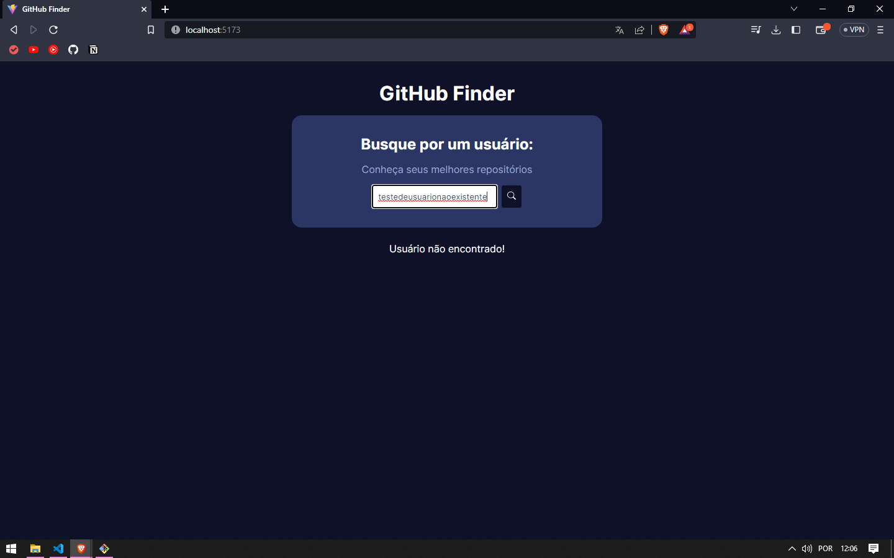

# 🕗 GitHub User Finder

Aplicação simples e objetiva para buscar informações de usuários no GitHub, utilizando a API pública da plataforma. Design clean, responsivo e com foco na experiência do usuário.

## 🚀 Tecnologias utilizadas

- [ReactJS](https://pt-br.reactjs.org/) — Biblioteca para construção de interfaces
- [TypeScript](https://www.typescriptlang.org/) — Superset de JavaScript para tipagem
- [Styled-components](https://styled-components.com/) — Estilização com CSS-in-JS

## 💻 Demonstração

### 🚫 Usuário não encontrado  


### ✅ Busca bem-sucedida  


## 🛠️ Funcionalidades

- 🔎 Busca de qualquer usuário público do GitHub.
- 📃 Exibição de dados como avatar, bio, seguidores, repositórios e mais.
- 🎨 Layout responsivo e estilização personalizada com styled-components.
- 🚫 Tratamento de erros para usuários não encontrados.

## 🔥 Como rodar localmente

```bash
# Clone o repositório
git clone https://github.com/nailsonlima/github_api_searcher

# Acesse a pasta
cd github_api_searcher

# Instale as dependências
npm install

# Rode o projeto
npm run dev

# Acesse em
http://localhost:5173/
```

🤝 Contribuição:  
Sinta-se à vontade para utilizar, melhorar e contribuir com este projeto. Toda sugestão é bem-vinda! 🚀

👨‍💻 Autor:  
Feito com dedicação por: Nailson Lima 🚀

🎯 Agradecimento:  
Obrigado por acessar este projeto! 💜
